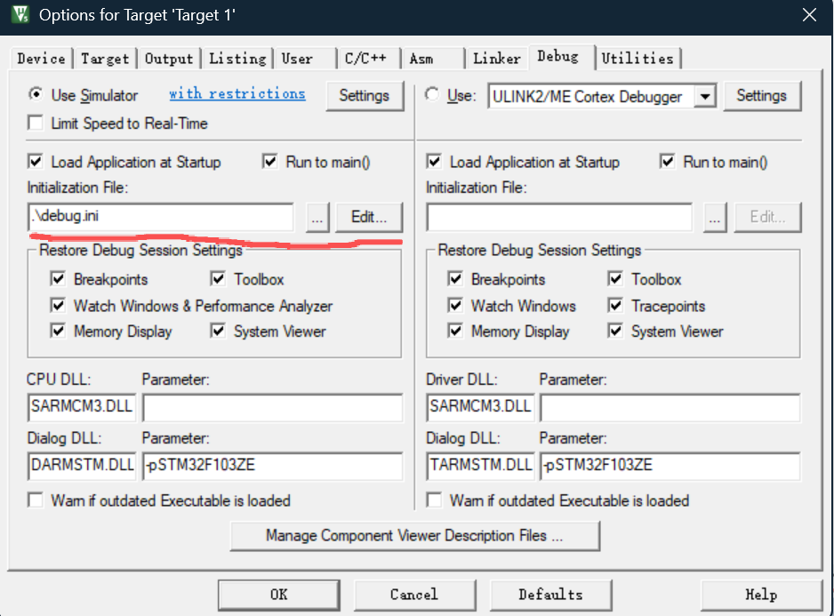
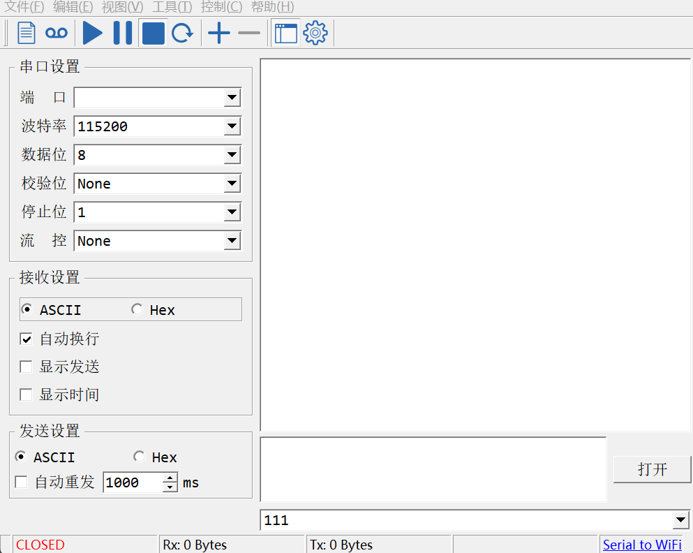
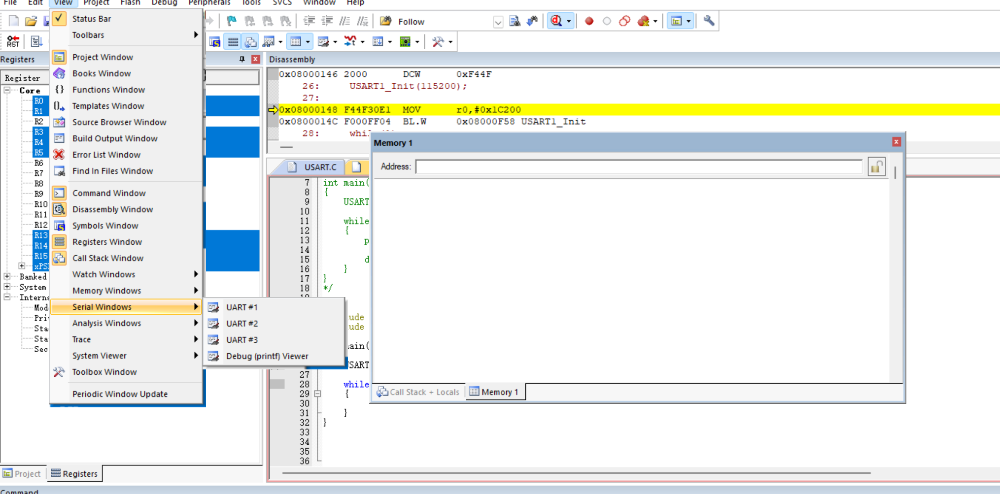
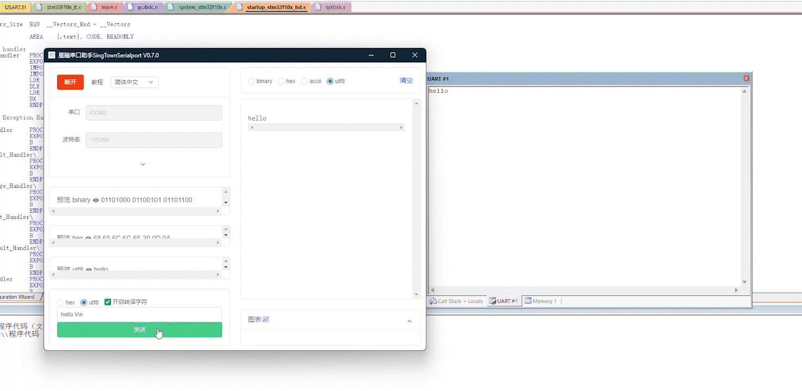

# 串口仿真调试工程

本项目基于 Keil MDK和 STM32 标准外设库，实现通过 **虚拟串口** 输出 `printf` 信息，用于在 **仿真模式** 下调试串口相关功能。
---
## 功能简介

- 使用 Keil 的 **仿真/软件调试** 功能，不依赖真实串口硬件即可调试
- 将 `printf` 重定向到 `USART1`
- 通过虚拟串口软件建立串口通道，在 PC 端串口调试助手查看打印信息
---
## 使用步骤

1. **下载源码**  
   使用 Git 克隆仓库：

   ```bash
   git clone https://github.com/if-zero-123/serial_port.git
   ```

2. **打开 Keil 工程**  
   使用 Keil MDK 打开根目录下的工程文件：`工程模板.uvproj` 或 `工程模板.uvprojx`。

3. **配置为软件仿真调试**  
   在 Keil 中依次打开：`Options for Target` → `Debug`，选择合适的 **Simulator** / **软件仿真**（而不是 J-LINK、ST-LINK 等硬件仿真器）。

4. **配置 ini 调试脚本（debug.ini）**  
   在同一 `Debug` 选项卡中，勾选 **Initialization File**，选择本工程提供的 ini 脚本：`debug.ini`，用于在仿真启动时将 Keil 模拟串口映射到 PC 端的虚拟串口。

   

5. **打开虚拟串口软件并创建虚拟串口**  
   - 打开你使用的虚拟串口工具（如 VSPD）  
   - 新建一对互联的虚拟串口（如 COM1–COM2），记住其中一个供串口调试助手使用
   

6. **打开串口调试助手**  
   在 PC 上打开串口调试工具：
   - 选择前一步创建的虚拟串口号（如 COM2）
   - 波特率与工程配置一致（例如 115200）
   - 数据位、停止位、校验位与工程中 `USART` 初始化配置保持一致
   

7. **进入 Keil 调试并运行**  
   - 在 Keil 中点击 **Start/Stop Debug Session** 进入调试模式  
   - 点击 **Run**（或按 F5）运行程序  
   - 打开串口数据窗口
   

---

## 效果演示



## 注意事项

- 若中文显示为乱码，请确认：  
  - 源码文件编码（UTF-8 / GBK 等）  
  - 串口调试助手的接收编码设置保持一致。
- 若没有看到任何输出，请检查：  
   - 是否正确加载了 `debug.ini` 调试脚本；  
  - 虚拟串口工具是否已成功创建串口，并且未被其他程序占用；  
  - 串口号和波特率设置是否与代码中配置一致。

---

## 虚拟串口助手下载

如需获取虚拟串口助手（或相关配套工具），可访问：[虚拟串口助手 GitCode 页面](https://gitcode.com/open-source-toolkit/6e2e5?utm_source=highlight_word_gitcode&word=%E8%99%9A%E6%8B%9F%E4%B8%B2%E5%8F%A3&isLogin=1&from_link=938a362f8a541fc9a5fff6943f4cb947)。

如果需要克隆，可以执行：

```bash
git clone https://gitcode.com/open-source-toolkit/6e2e5.git
```

## debug.ini 说明

根目录下提供的 `debug.ini` 内容如下：

```ini
MODE COM1 115200,0,8,1
ASSIGN COM1 <S1IN> S1OUT
```

- `MODE COM1 115200,0,8,1`：在 Keil 仿真器中配置一个名为 `COM1` 的串口，波特率 `115200`，无校验（0）、数据位 8、停止位 1。  
- `ASSIGN COM1 <S1IN> S1OUT`：将 Keil 的串口窗口 `Serial #1` 的输入/输出（`S1IN` / `S1OUT`）绑定到 `COM1`，这样仿真时就能通过虚拟串口与外部串口工具通信。

## 代码说明：`APP/USART.C`

- `USART1_Init(uint32_t baudrate)`：配置 GPIOA9/10 为串口引脚，开启 `USART1` 时钟，按指定波特率初始化串口，并开启接收中断和 NVIC 配置。
- `USART1_SendChar` / `USART1_SendString`：阻塞方式发送 1 个字符或一串字符，底层通过 `USART_SendData` 写入数据寄存器。
- `fputc`：重定向 C 库 `printf`，把所有 `printf` 输出的字符通过 `USART1_SendChar` 发到串口上。
- `USART1_GetChar`：从接收环形缓冲区中取出 1 个字节（非阻塞），若没有数据则返回 0。
- `USART1_IRQHandler`：串口1接收中断服务函数，把收到的每个字节放入环形缓冲区，并使用 `printf("%c", c)` 在串口上回显收到的数据。

## 扩展项目

本工程主要用于演示 **Keil 仿真 + 虚拟串口 + printf 重定向** 的基本用法。
在此基础上，我还在其它仓库中扩展了：

- **[Letter shell 项目](https://github.com/if-zero-123/Letter_sim)**：基于本工程封装好的 `printf`和 `USART1_GetChar`串口接口移植 Letter shell，
   实现串口命令行交互、变量查看与任务调度功能，实现伪终端。
- **[LCD 优化驱动库](https://github.com/if-zero-123/LCD_driver)**：结合优化后的 LCD 显示驱动进行简单的显示和结合上位机实现播放简单动画。
